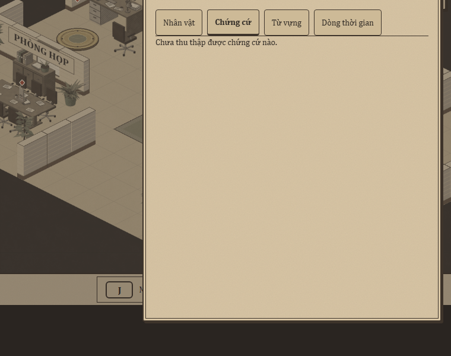
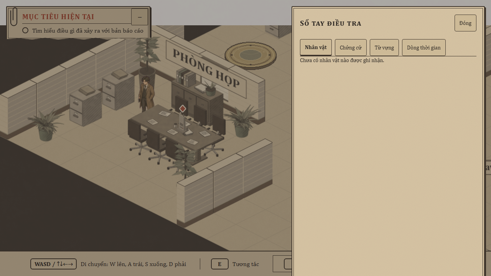

# Feedback hai lượt chơi độc lập và đề xuất cải thiện

Ngày 2026-10-01, bản `9cff732` trên `dev`, chạy Vite bằng Node22.23.3 tại localhost5173. Người dùng yêu cầu hai agent đóng vai người chơi, lấy feedback gameplay/giao diện để cải thiện game.

## Phương pháp và giới hạn

Hai agent dùng Chromium context mới với save độc lập, thao tác UI thật qua Playwright, quan sát DOM hiển thị và screenshot canvas. Không teleport, debug API, sửa state, đọc lời giải/content hoặc dùng script hành trình E2E. Đây là hai persona AI; không phải kết quả nghiên cứu với người chơi con người. Thời lượng khoảng15phút mỗi lượt có tính overhead công cụ, không dùng làm số đo thời gian hoàn thành của người thật.

Agent bàn phím vô tình gặp tên đáp án khi đọc rule frontend (dòng mô tả E2E); không dùng thông tin đó và không thực hiện accusation. Hai lượt chưa tới portal, accusation, kết thúc case hoặc kiểm reload. Không đánh giá âm thanh qua browser headless. Không thay acceptance cổng đồng/nhạc đã được người dùng xác nhận.

| Persona | Cách chơi | Đạt được | Chưa đạt |
| --- | --- | --- | --- |
| Chuột desktop1280×720 | Click NPC/sàn/prompt, dùng nút HUD | Hỏi ba nhánh Anna, Meeting Minutes1/5, xem lại evidence/timeline; đổi mode Cơ bản trong Settings và thấy bản dịch | Hai NPC còn lại, portal, accusation, hoàn thành case |
| Bàn phím compact760×600 | Arrow/E/Tab/Enter/Escape, chuyển chuột khi gặp khó tiếp cận bàn | Hỏi hai nhánh Anna, mở nghĩa từ, notebook/map/Settings |0/5evidence; khó tiếp cận bàn, chưa hoàn thành |

Report nguyên bản: [chuột](playtests/2026-10-01/player-mouse.md), [bàn phím](playtests/2026-10-01/player-keyboard.md). Ảnh chính được lưu cùng report trong Git; các ảnh chi tiết khác ở scratch `.superpowers/playtest/2026-10-01/`.

## Findings sau đối chiếu

### P1 — Focus cuộn vùng game, che header và nút Đóng

Quan sát trực tiếp ở compact: ArrowLeft+ArrowDown khoảng350ms tới Anna → E → Tab tới từ `left` → Enter mở nghĩa → Escape đóng tooltip → hỏi thêm → Escape dialogue → J notebook. Header/tên người nói bị cắt; notebook mất toàn bộ header/nút Đóng. Offset còn tồn tại qua map/pause, Tab về objective có thể đưa viewport trở lại.

Số đo: window.scrollY0, body600/600, game-root clientHeight600/scrollHeight686/scrollTop86 (overflow:hidden), notebook overlay y−86, panel y−70/h612, nút Đóng top−48/bottom−4. Parent xem ảnh và đối chiếu CSS/focus source: notebook panel height100% cộng padding, overlay chưa box-sizing:border-box; focus vocabulary/return/trap mặc định có thể cuộn ancestor. Đây là các nguyên nhân cần tách bằng regression, chưa tuyên bố fix hay root cause duy nhất.

Impact: mất control và ngữ cảnh người nói, thế giới/HUD dịch chuyển. Expected: viewport game đứng yên, panel cuộn nội dung riêng và control cần thiết vẫn thấy được.

### P1 — Tab Nhân vật luôn báo trống dù đã hỏi NPC

Chuột hỏi cả ba lựa chọn của Anna, sau đó thu Meeting Minutes rồi mở Nhân vật: vẫn “Chưa có nhân vật nào được ghi nhận”. Evidence và timeline vẫn lưu đúng1/5. Parent xác minh `NotebookPanel.tsx` render empty state vô điều kiện cho tab people; đây là thiếu hiển thị sổ tay, chưa có bằng chứng mất save hay dialogue state.

Docs01 mục19 coi notebook là trung tâm meta-game, docs03 có tabPeople và yêu cầu notebook cập nhật realtime. Cần bổ sung cách hiển thị người đã gặp/lời khai đã biết từ state hiện có, không hiển thị thông tin chưa khám phá. Quy tắc mapping lời khai cần thiết kế trước triển khai; không suy ra mọi dialogue có text đã lưu sẵn.

Impact: người chơi không biết lời khai có được ghi nhận và khó đối chiếu khi điều tra. Ưu tiên cùng nhóm lỗi viewport, nhưng sửa trong gói riêng vì có contract dữ liệu hiển thị.

### P2 — Khó hiểu hành động mở đầu và điều khiển chuột

Desktop chỉ có mục tiêu chung về báo cáo và footer WASD/E/J/M/Esc; chưa giải thích click xa đi tới, click lại tương tác. Compact còn ẩn mục tiêu sau icon◎ và bỏ hướng dẫn di chuyển/E. Agent bàn phím mở mục tiêu muộn; agent chuột phải thử để hiểu click.

Đề xuất: cue ngắn cho mục tiêu và cách chơi khi bắt đầu, có thể mở lại hướng dẫn; nội dung từ content, không tutorial dài hoặc dẫn lời giải. Giữ khả năng thu HUD, translation chỉ Settings và semantic click đã chốt. Đây là cải thiện discoverability, không coi HUD collapsed tự thân là lỗi.

Ảnh: [desktop](playtests/2026-10-01/desktop-start.png), [compact](playtests/2026-10-01/compact-start.png).

### P2 — Khó tìm vị trí tương tác quanh bàn ở compact

Agent bàn phím thấy diamond trên bàn, thử Arrow/E và sau đó click/chờ/click lại nhưng chưa thu được. Agent chuột desktop đã thu được Meeting Minutes qua prompt. Vì viewport compact bị cuộn, chưa đủ bằng chứng kết luận pathfinding/collider lỗi.

Đề xuất: chơi lại sau fix viewport; ghi đường tiếp cận và feedback ngoài phạm vi. Chỉ sửa collider/path nếu tái hiện được sai contract; không nới radius hoặc teleport để che vấn đề.

### P3 — Click vùng bị wall che thiếu phản hồi dễ nhận biết

Agent chuột click prop/wall trái (x72,y329) đứng yên, sau đó click sàn (x230,y421) đi được. Parent thấy source nhánh opaque-wall tiêu thụ click/cancel route mà không hiện blocked indicator; nhánh pathfail có indicator700ms. Không phải bằng chứng pathfinding hỏng.

Đề xuất: feedback nhẹ, nhất quán cho click không tiếp cận được, vẫn chặn chọn xuyên wall; không đổi luật tương tác hoặc màu đỏ ngoài guardrail.

### P3 — Copy nút Bản đồ chưa nói rõ toggle minimap

Khi minimap đang hiện, bấm “Bản đồ” làm ẩn nó. Agent định dùng map tìm đường nên thấy phản hồi khó đoán. Đề xuất copy/accessible state diễn đạt Ẩn/Hiện bản đồ nhỏ; không mở rộng thành hệ thống bản đồ mới.

## Những điểm nên giữ

- Art giấy/sepia và tên NPC tạo ngữ cảnh điều tra nhất quán.
- Prompt trong phạm vi nêu đối tượng cụ thể; click xa/đến nơi/click lại dùng được ở lượt desktop.
- Nhặt evidence tăng counter ngay; notebook xem lại nội dung và timeline từ evidence hoạt động.
- Vocabulary mở theo thao tác, nghĩa/ví dụ gắn lời khai; Escape đóng tooltip trước dialogue đúng.
- Settings có translation/subtitle/reduced motion, điều hướng Tab được; mode Cơ bản được áp dụng vào evidence desktop.

## Gói cải thiện đầu tiên đề xuất — sửa viewport/focus (bounded)

Phạm vi: sửa layout overlay/panel và hành vi focus để game-root không scroll do popup/modal, nội dung dài cuộn trong panel và control được giữ trong viewport. Kiểm tra cả dialogue/vocabulary, notebook, evidence và pause; không đổi movement/camera/projection, save hoặc nội dung vụ án.

File dự kiến: gameShell.css, notebook.css, vocabulary/dialogue/evidence/pause focus code nếu regression chứng minh liên quan. Chưa quyết định máy móc thêm preventScroll vào mọi nơi: Tab vẫn phải đưa control vào vùng cuộn nội bộ thấy được.

Verification dự kiến: browser regression760×600 tái hiện chuỗi trên phải RED trước fix; GREEN với root.scrollTop=0, Close/focused control nằm trong viewport qua đổi modal, nội dung dài vẫn đọc được. Đối chiếu1280×720, focus/keyboard/mouse, rồi lint/test/build/typecheck/format và E2E nhóm liên quan; fullsuite khi phạm vi runtime justify.

Sau gói này: thiết kế tabNhân vật từ dữ kiện đã khám phá; sau đó mới cue mở đầu/hướng dẫn và copy/feedback. Không tự triển khai tất cả đề xuất trong một lượt hoặc tự mở phase mới.

**Trạng thái:** Playtest/đối chiếu hoàn tất; chưa sửa source, gói viewport/focus chờ người dùng duyệt thiết kế bounded theo skill brainstorming. Báo cáo này không phải bằng chứng các lỗi đã được sửa. Không push báo cáo phân tích khi chưa được người dùng xác nhận.

Kiểm tra tài liệu: `npm run format:check` → `All matched files use Prettier code style!`; `git diff --check` không lỗi. Không chạy lại lint/test/build vì lượt này chỉ thêm báo cáo/ảnh, không thay source/tests hay tuyên bố gameplay đã được sửa. Verification sản phẩm trước đó giữ lịch sử trong memory, không tính là kết quả playtest mới.
